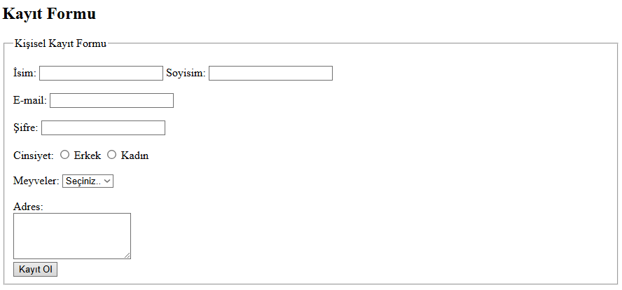

# Form Elemanlarının Kullanımı ile Oluşturulan Kayıt Formu 
----------------------------------------------------------

## Sırasıyla Kullanılan Form Öğeleri;

```
<fieldset>
<legend>
<label>
<input>
<textarea>
<button>
<select>
<option>
```
----------------------------------------------------------

## Sırasıyla Kullanılan Input Türleri;

```
type="text"
type="email"
type="radio"
type="password"
```
---------------------------------------------------------- 
<br>

